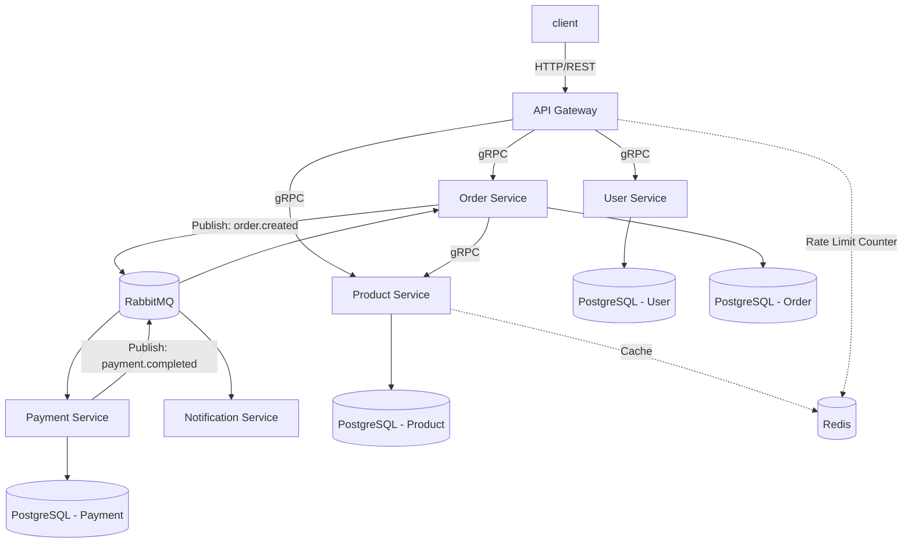
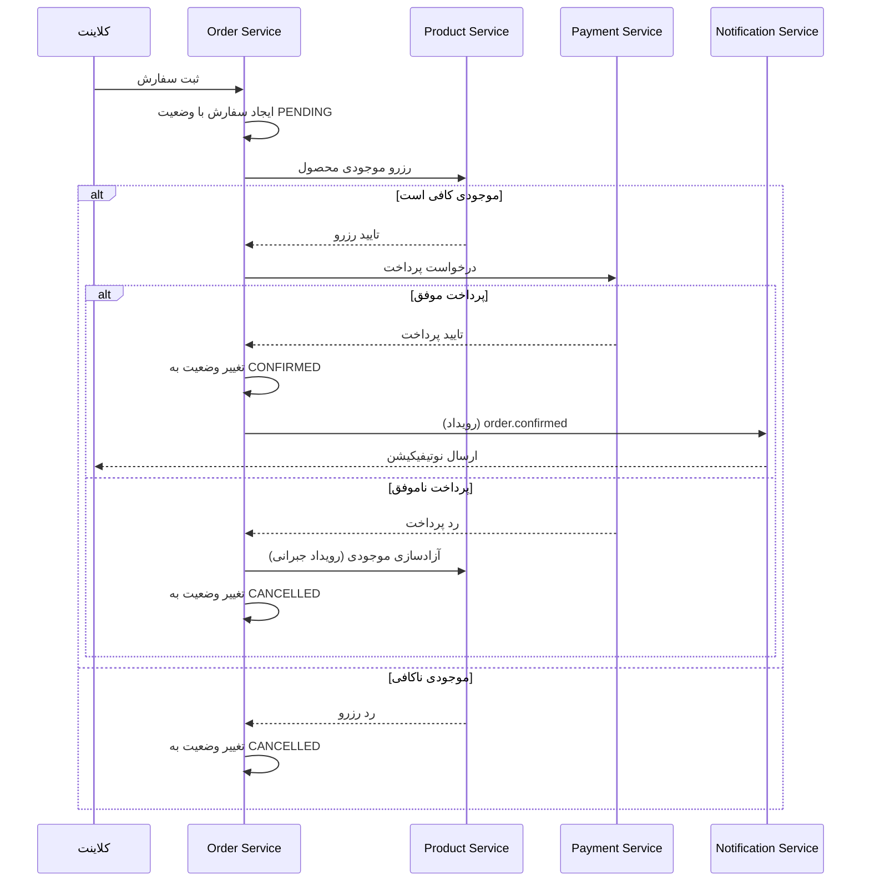
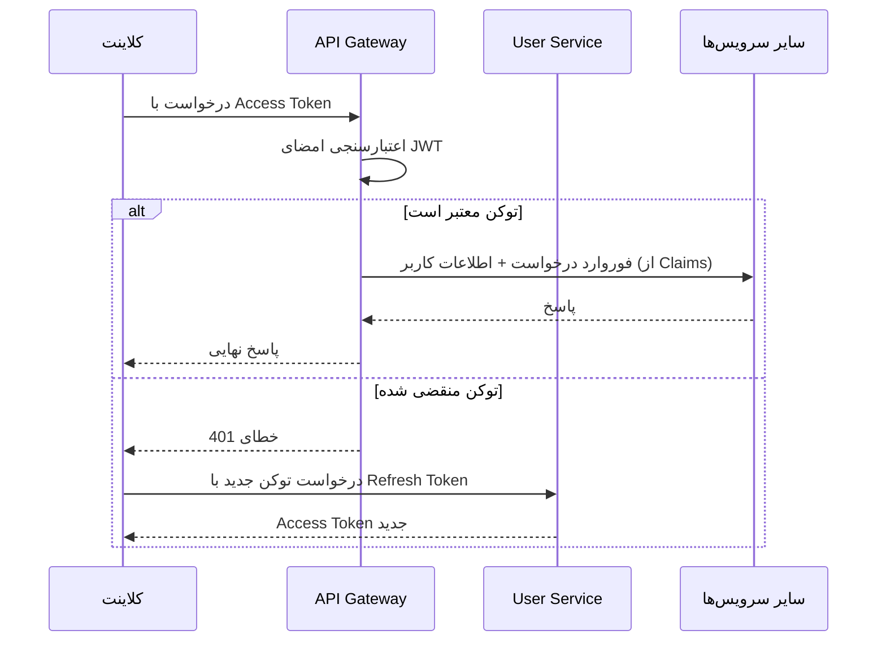

<!-- docs/architecture.md -->

# معماری سیستم

در این فایل معماری فنی پروژه، نحوه ارتباط سرویس‌ ها و الگو های طراحی شرح داده می شود.

## ۱. نمای کلی

سیستم از یک **API Gateway** به عنوان نقطه ورود واحد استفاده می‌کند که تمامی درخواست‌های خارجی را دریافت کرده و پس از احراز هویت اولیه، به سرویس مربوطه مسیریابی می‌کند. هر سرویس، دیتابیس اختصاصی خود را دارد (الگوی Database-per-Service) و ارتباط بین سرویس‌ها ترکیبی از حالت همزمان (REST/gRPC) و ناهمزمان (RabbitMQ) است.

## ۲. شرح سرویس‌ها

### API Gateway

نقطه ورود واحد سیستم است و مسئولیت‌های زیر را بر عهده دارد:

- مسیریابی درخواست‌ها به سرویس مقصد
- اعتبارسنجی JWT پیش از رسیدن درخواست به سرویس‌ها
- اعمال Rate Limiting بر اساس IP یا شناسه کاربر (با استفاده از Redis)
- لاگ متمرکز درخواست‌ها

### User Service

مدیریت کاربران، احراز هویت و صدور توکن را انجام می‌دهد:

- ثبت‌نام و ورود با رمز عبور
- صدور JWT و Refresh Token
- احراز هویت دو مرحله‌ای با OTP (کد در Redis با TTL کوتاه نگهداری می‌شود)
- مدیریت نقش‌های کاربری (Admin, Member, Viewer) برای پیاده‌سازی RBAC

### Product Service

مدیریت کاتالوگ محصولات:

- عملیات CRUD روی محصولات (محدود به نقش Admin)
- جست‌وجوی محصولات
- کش کردن نتایج پرتکرار (مثلاً محصولات پرفروش) در Redis برای کاهش فشار روی دیتابیس

### Order Service

مدیریت چرخه حیات سفارش و هماهنگ‌کننده الگوی Saga:

- ثبت سفارش و تغییر وضعیت آن
- شروع تراکنش توزیع‌شده بین Order، Payment و Product (کسر موجودی)
- انتشار رویدادها هنگام تغییر وضعیت سفارش

### Payment Service

شبیه‌سازی درگاه پرداخت:

- دریافت درخواست پرداخت از طریق رویداد یا فراخوانی مستقیم
- تایید یا رد پرداخت و انتشار نتیجه به صورت رویداد

### Notification Service

مصرف‌کننده صرف رویدادهاست و هیچ API عمومی برای کلاینت ندارد:

- گوش‌دادن به رویدادهایی مثل `order.created` و `payment.completed`
- شبیه‌سازی ارسال پیامک/ایمیل

## ۳. الگوهای ارتباطی: چرا Sync و چرا Async؟

| ارتباط                         | نوع              | دلیل انتخاب                                                                                                                          |
| ------------------------------ | ---------------- | ------------------------------------------------------------------------------------------------------------------------------------ |
| Gateway → سرویس‌ها             | REST             | ساده، مناسب برای درخواست‌های مستقیم کاربر که نیاز به پاسخ فوری دارند                                                                 |
| Order → Payment                | gRPC/REST        | نیاز به پاسخ فوری برای ادامه فرآیند Saga (موفق/ناموفق بودن پرداخت)                                                                   |
| Order → Notification           | Async (RabbitMQ) | نوتیفیکیشن نیازی به پاسخ فوری ندارد؛ نباید سرعت ثبت سفارش را کند کند یا در صورت خرابی Notification Service، کل فرآیند سفارش مختل شود |
| Payment → Order (نتیجه پرداخت) | Async (RabbitMQ) | جدا کردن چرخه حیات دو سرویس؛ Order نباید منتظر بمانَد و Payment نباید به‌طور مستقیم به دیتابیس Order وابسته باشد                     |

_قاعده کلی:_

اگر پاسخ فوری برای ادامه یک فرآیند حیاتی لازم است → Sync.

اگر عملیات جانبی است یا می‌تواند با تاخیر انجام شود → Async.

## ۴. جریان ثبت سفارش (الگوی Saga)

از آنجا که هر سرویس دیتابیس مجزا دارد، نمی‌توان از تراکنش‌های ACID سنتی بین سرویس‌ها استفاده کرد. به همین دلیل از الگوی **Choreography-based Saga** استفاده می‌شود: هر سرویس پس از انجام کار خود رویدادی منتشر می‌کند و سرویس بعدی به آن گوش می‌دهد. در صورت شکست هر مرحله، رویداد جبرانی (Compensating Event) برای بازگرداندن تغییرات قبلی منتشر می‌شود.

## ۵. مدیریت داده

هر سرویس دیتابیس PostgreSQL مستقل خود را دارد و مستقیماً به دیتابیس سرویس دیگر دسترسی ندارد. این تصمیم استقلال سرویس‌ها را افزایش می‌دهد اما به معنای پذیرفتن **Eventual Consistency** بین سرویس‌هاست (جزئیات و پیامدهای این تصمیم در [docs/decisions/001-initial-project-structure-setup.md](decisions/001-initial-project-structure-setup.md) شرح داده شده است).

استراتژی کش:

- Product Service نتایج جست‌وجوی پرتکرار را با TTL مشخص در Redis کش می‌کند
- User Service کد OTP و Session های موقت را در Redis نگه می‌دارد (نه در دیتابیس اصلی)

## ۶. امنیت و احراز هویت

نکات کلیدی:

- اعتبارسنجی امضای JWT در سطح Gateway انجام می‌شود تا سرویس‌های داخلی درگیر منطق احراز هویت نشوند
- بررسی نقش کاربر (RBAC) در سطح هر سرویس و بر اساس Claims موجود در توکن انجام می‌شود
- Refresh Token عمر طولانی‌تری دارد و در دیتابیس User Service (به همراه امکان ابطال) نگهداری می‌شود

## ۷. تحمل خطا (Resilience)

- **Rate Limiting**: در سطح Gateway با شمارنده Redis پیاده‌سازی می‌شود تا از سرویس‌ها در برابر بار زیاد محافظت شود
- **Saga Compensation**: در صورت شکست هر مرحله از فرآیند سفارش، رویدادهای جبرانی تغییرات قبلی را خنثی می‌کنند
- **Idempotency**: مصرف‌کنندگان رویداد (مثل Notification Service) باید طوری طراحی شوند که پردازش تکراری یک پیام، اثر ناخواسته نداشته باشد

## ۸. دید Deployment

در محیط توسعه، تمامی سرویس‌ها، دیتابیس‌ها، Redis و RabbitMQ با یک فایل `docker-compose.yml` واحد اجرا می‌شوند (فایل [docker/docker-compose.yml](../docker/docker-compose.yml)). هر سرویس Dockerfile مستقل خود را دارد تا امکان build و deploy جداگانه در آینده وجود داشته باشد.

