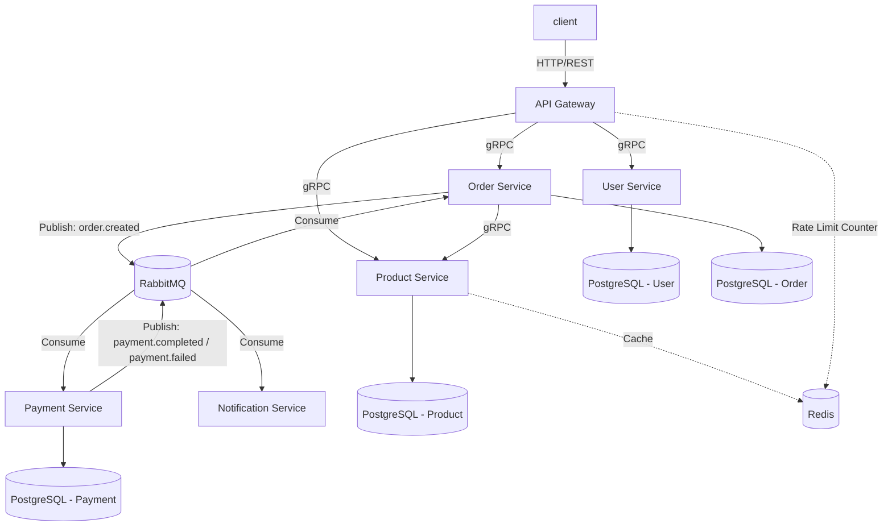
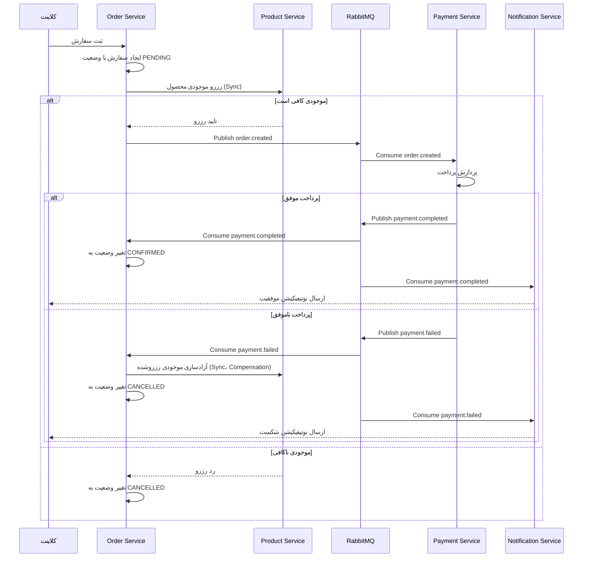
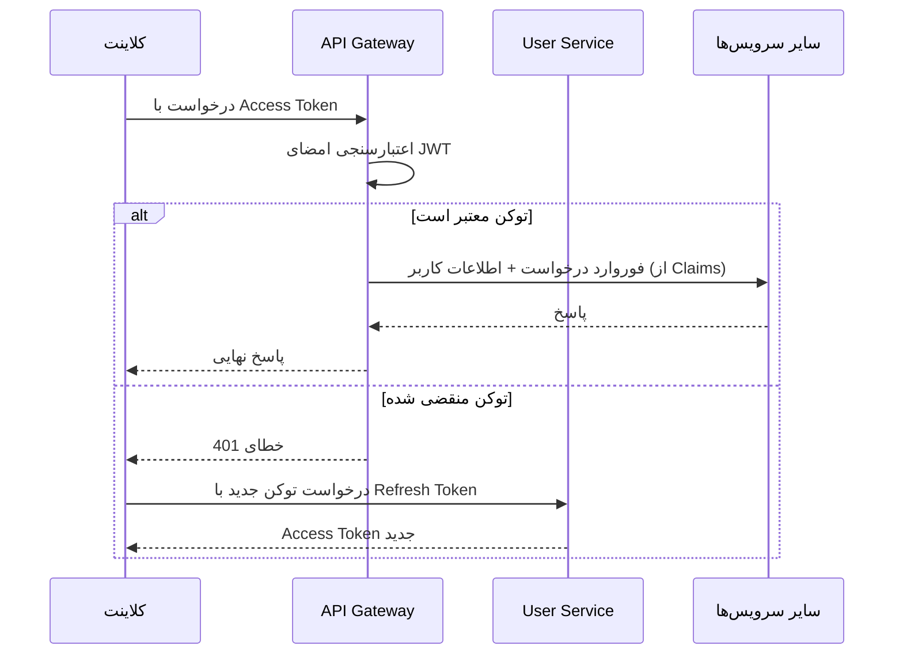

<!-- docs/architecture.md -->

<div dir="rtl">

# معماری سیستم

در این فایل معماری فنی پروژه، نحوه ارتباط سرویس‌ ها و الگو های طراحی شرح داده می شود.

## ۱. نمای کلی

سیستم از یک **API Gateway** به عنوان نقطه ورود واحد استفاده می‌کند که تمامی درخواست‌های خارجی (**REST**) را دریافت کرده و پس از احراز هویت اولیه،آنها را از طریق **gRPC** به سرویس مربوطه مسیریابی می‌کند. هر سرویس، دیتابیس اختصاصی خود را دارد (الگوی Database-per-Service) و ارتباط بین سرویس‌ها ترکیبی از حالت همزمان (gRPC برای عملیات هایی که که نیاز به پاسخ فوری دارند) و ناهمزمان (RabitMQ برای فرایند های رویداد محور) است.



## ۲. شرح سرویس‌ها

### API Gateway

نقطه ورود واحد سیستم است و هیچ نقشی در Business Logic ندارد و تنها مسئولیت‌های زیر را بر عهده دارد :

- مسیریابی درخواست‌ها به سرویس مقصد (Routing)
- اعتبارسنجی JWT پیش از رسیدن درخواست به سرویس‌ها Authentication
- اعمال Rate Limiting بر اساس IP یا شناسه کاربر (با استفاده از Redis) (Rate Limit)
- لاگ متمرکز درخواست‌ها (Logging)

### User Service

مدیریت کاربران، احراز هویت و صدور توکن را انجام می‌دهد:

- ثبت‌نام و ورود با رمز عبور
- صدور JWT و Refresh Token
- احراز هویت دو مرحله‌ای با OTP (کد در Redis با TTL کوتاه نگهداری می‌شود)
- مدیریت نقش‌های کاربری (Admin, Member, Viewer) برای پیاده‌سازی RBAC

### Product Service

مدیریت کاتالوگ محصولات:

- عملیات CRUD روی محصولات (محدود به نقش Admin)
- جست‌وجوی محصولات
- کش کردن نتایج پرتکرار (مثلاً محصولات پرفروش) در Redis برای کاهش فشار روی دیتابیس
- ارائه عملیات رزرو و آزادسازی موجودی برای Order Service (فراخوانی sync از طریق gRPC)

### Order Service

مدیریت چرخه حیات سفارش و هماهنگ‌کننده الگوی Saga:

- ثبت سفارش و تغییر وضعیت آن
- رزرو موجودی محصول از طریق فراخوانی sync به Product Service
- انتشار رویداد `order.created` برای شروع فرآیند پرداخت
- گوش‌دادن به نتیجه پرداخت (`payment.completed` / `payment.failed`) و به‌روزرسانی وضعیت سفارش؛ در صورت شکست پرداخت، آزادسازی موجودی رزروشده (Compensation)

### Payment Service

این سرویس هیچ API مستقیمی برای فراخوانی Sync با آن ندارد و تنها از طریق رویداد ها با آن تعامل میشود :

- گوش‌دادن به رویداد `order.created`
- پردازش (شبیه‌سازی) پرداخت
- انتشار نتیجه به‌صورت رویداد: `payment.completed` یا `payment.failed`

### Notification Service

مصرف‌کننده صرف رویدادهاست و هیچ API عمومی برای کلاینت ندارد:

- گوش‌دادن به رویدادهایی مثل `order.created` و `payment.completed`
- شبیه‌سازی ارسال پیامک/ایمیل

### pkg

هر چیزی که قرار است توسط چند سرویس استفاده شود و وابسته به Business Logic یک سرویس خاص نیست، می‌تواند داخل pkg باشد.
پس pkg فقط شامل کدهای عمومی و قابل استفاده مجدد است و نباید شامل Business Logic مربوط به یک سرویس خاص باشد.

ساختار :

<div dir="ltr">

```text
pkg/

├── logger
├── errors
├── proto
├── rabbitmq
└── auth
```

</div>

به این ترتیب همه سرویس‌ها از لاگر، خطاهای استاندارد، رَپِر یکسان برای RabbitMQ، قرارداد یکسان برای gRPC و منطق مشترک احراز هویت استفاده می‌کنند.

### scripts

نقش اصلی این قسمت برای انجام کار های تکراری است و حاوی این قسمت هاست:

<div dir="ltr">

```text
scripts/

├── migrate.sh ‍‍         # اجرای مایگریشن های دیتابیس هر سرویس
├── generate-proto.sh   # تولید کد Go از فایل‌های .proto
├── start-dev.sh        # بالا آوردن کل سیستم برای توسعه محلی
├── test.sh             # اجرای تست‌های تمام سرویس‌ها
└── wait-for-db.sh      # انتظار برای آماده شدن دیتابیس پیش از اجرا
```

</div>

## ۳. الگوهای ارتباطی: چرا Sync و چرا Async؟

| ارتباط                                                   | نوع              | دلیل انتخاب                                                                                                                      |
| -------------------------------------------------------- | ---------------- | -------------------------------------------------------------------------------------------------------------------------------- |
| Client → Gateway                                         | REST             | ساده‌ترین و سازگارترین پروتکل برای کلاینت‌های خارجی (وب/موبایل)                                                                  |
| Gateway → سرویس‌ها                                       | gRPC             | ارتباط داخلی سیستم؛ عملکرد بهتر و قرارداد نوع‌دار (strongly-typed) نسبت به REST                                                  |
| Order → Product (رزرو/آزادسازی موجودی)                   | Sync (gRPC)      | باید پیش از ادامه فرآیند سفارش، از کافی بودن موجودی مطمئن شد؛ نمی‌توان این مرحله را با تاخیر انجام داد                           |
| Order → Payment (`order.created`)                        | Async (RabbitMQ) | فرآیند پرداخت می‌تواند زمان‌بر باشد؛ Order نباید منتظر پاسخ فوری بماند و در صورت خرابی موقت Payment Service، ثبت سفارش مختل نشود |
| Payment → Order (`payment.completed` / `payment.failed`) | Async (RabbitMQ) | همان استدلال بالا، در جهت معکوس؛ همچنین جدا نگه‌داشتن چرخه حیات دو سرویس از یکدیگر                                               |
| Payment/Order → Notification                             | Async (RabbitMQ) | نوتیفیکیشن یک عملیات جانبی است و نباید سرعت فرآیند اصلی را کند کند یا در صورت خرابی، آن را متوقف کند                             |

_قاعده کلی:_

اگر پاسخ فوری برای ادامه یک فرآیند حیاتی لازم است (مثل تایید موجودی) → Sync.

اگر عملیات جانبی است یا می‌تواند با تاخیر انجام شود (مثل پرداخت یا اطلاع‌رسانی) → Async.

## ۴. جریان ثبت سفارش (الگوی Saga)

از آنجا که هر سرویس دیتابیس مجزا دارد، نمی‌توان از تراکنش‌های ACID سنتی بین سرویس‌ها استفاده کرد. رزرو موجودی به‌صورت sync و فوری انجام می‌شود، اما ادامه فرآیند (پرداخت و اطلاع‌رسانی) به‌صورت **Choreography-based Saga** و از طریق رویداد پیش می‌رود: هر سرویس پس از انجام کار خود رویدادی منتشر می‌کند و سرویس بعدی به آن گوش می‌دهد. در صورت شکست پرداخت، رویداد `payment.failed` باعث اجرای عملیات جبرانی (آزادسازی موجودی) می‌شود.



## ۵. مدیریت داده

هر سرویس دیتابیس PostgreSQL مستقل خود را دارد و مستقیماً به دیتابیس سرویس دیگر دسترسی ندارد. این تصمیم استقلال سرویس‌ها را افزایش می‌دهد اما به معنای پذیرفتن **Eventual Consistency** بین سرویس‌هاست (جزئیات و پیامدهای این تصمیم در [docs/decisions/001-initial-project-structure-setup.md](decisions/001-initial-project-structure-setup.md) شرح داده شده است).

استراتژی کش:

- Product Service نتایج جست‌وجوی پرتکرار را با TTL مشخص در Redis کش می‌کند
- User Service کد OTP و Session های موقت را در Redis نگه می‌دارد (نه در دیتابیس اصلی)

## ۶. امنیت و احراز هویت



نکات کلیدی:

- اعتبارسنجی امضای JWT در سطح Gateway انجام می‌شود تا سرویس‌های داخلی درگیر منطق احراز هویت نشوند
- بررسی نقش کاربر (RBAC) در سطح هر سرویس و بر اساس Claims موجود در توکن انجام می‌شود
- Refresh Token عمر طولانی‌تری دارد و در دیتابیس User Service (به همراه امکان ابطال) نگهداری می‌شود

## ۷. تحمل خطا (Resilience)

- **Rate Limiting**: در سطح Gateway با شمارنده Redis پیاده‌سازی می‌شود تا از سرویس‌ها در برابر بار زیاد محافظت شود
- **Saga Compensation**: در صورت شکست پرداخت، رویداد `payment.failed` باعث آزادسازی موجودی رزروشده در Product Service می‌شود (شرح کامل در بخش ۴)
- **Idempotency**: مصرف‌کنندگان رویداد (Order، Notification) باید طوری طراحی شوند که پردازش تکراری یک پیام (مثلاً در اثر redelivery صف)، اثر ناخواسته یا تکراری نداشته باشد

## ۸. دید Deployment

در محیط توسعه، تمامی سرویس‌ها، دیتابیس‌ها، Redis و RabbitMQ با یک فایل `docker-compose.yml` واحد اجرا می‌شوند (فایل [docker/docker-compose.yml](../docker/docker-compose.yml)). هر سرویس Dockerfile مستقل خود را دارد تا امکان build و deploy جداگانه در آینده وجود داشته باشد.

## 9. ساختار event ها

<div dir="ltr">

| Event             | Producer | Consumer            |
| ----------------- | -------- | ------------------- |
| order.created     | Order    | Payment             |
| payment.completed | Payment  | Order, Notification |
| payment.failed    | Payment  | Order, Notification |

</div>

## 10. Service Discovery

در محیط توسعه، سرویس‌ها از طریق نام سرویس‌های Docker Compose با یکدیگر ارتباط برقرار می‌کنند.

مثال:

<div dir="ltr">

```text
product-service:50051

rabbitmq:5672

redis:6379
```

</div>

## 11. Request Flow

<div dir="ltr">

```text
Client → Gateway → Order Service → Product Service (reserve stock, sync)
                          ↓
                    Order Database
                          ↓
                  RabbitMQ (order.created)
                          ↓
                   Payment Service
                          ↓
      RabbitMQ (payment.completed / payment.failed)
                    ↙            ↘
          Order Service      Notification Service
       (update status /
        release stock on failure)
```

</div>

</div>
